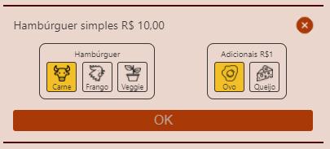
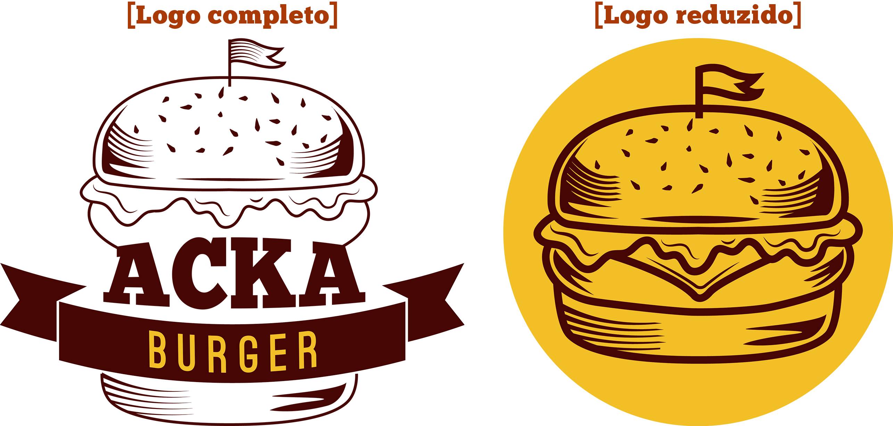
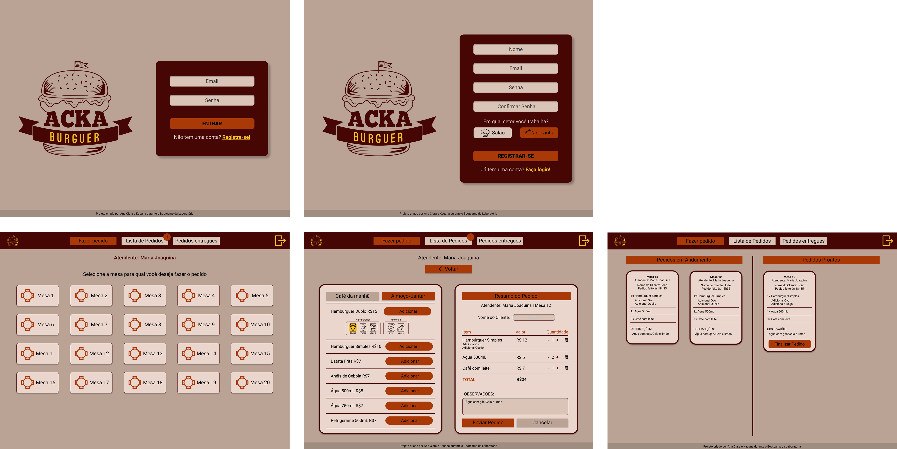
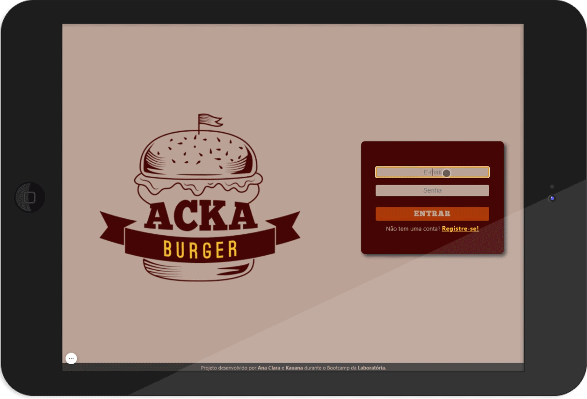
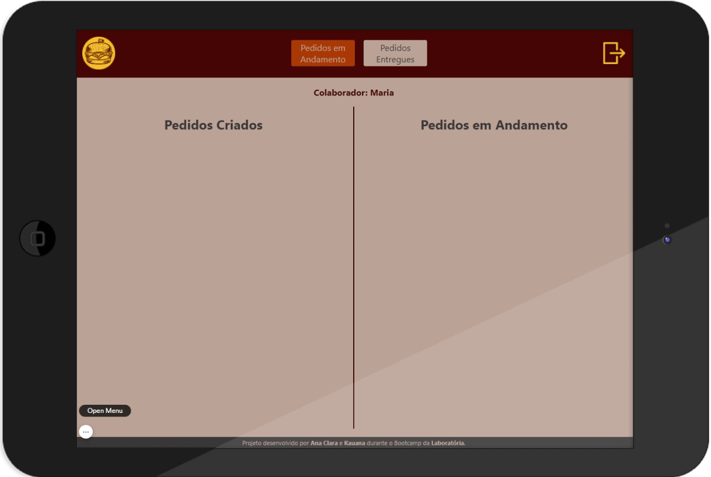
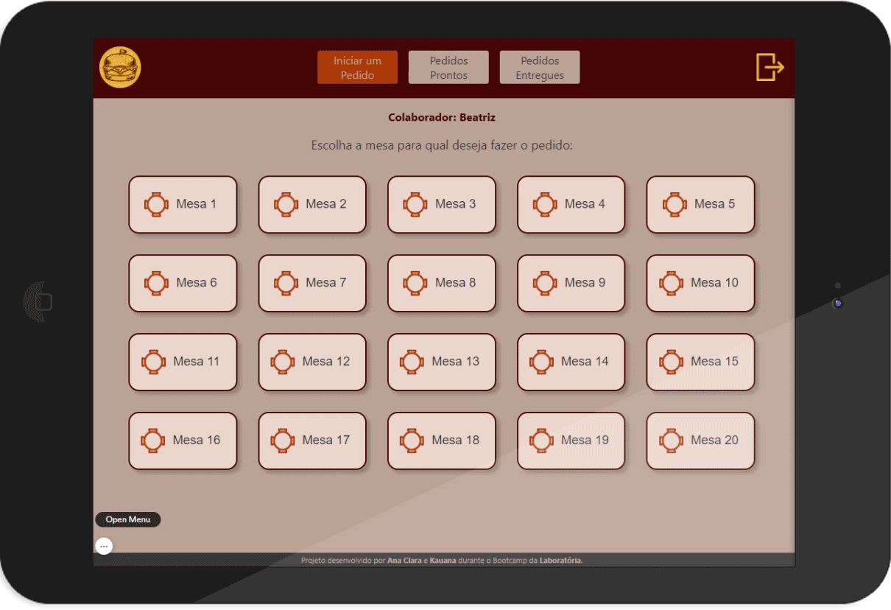

<h1 align="center">
  
</h1>

# Acka Burger

Aplicação web para o restaurante Acka Burger. A interface auxilia os funcionários do salão e da cozinha a fazerem e prepararem os pedidos de forma ordenada e eficiente.

> Status do Projeto: Concluído :heavy_check_mark:

## Índice

- [1. Apresentação da Demanda](#1-apresentação-da-demanda)
- [2. Identificação Visual da Marca](#2-identificação-visual-da-marca)
- [3. Estrutura e funcionalidades](#3-estrutura-e-funcionalidades)
- [4. Teste de Usabilidade](#4-teste-de-usabilidade)
- [5. Ferramentas Utilizadas](#5-ferramentas-utilizadas)
- [6. Considerações Finais](#6-considerações-finais)
- [7. Desenvolvedoras]

---

## 1. Apresentação da Demanda

O cliente é uma hamburgueria 24 horas chamada Acka Burger e pediu um sistema que ajudasse a receber os pedidos dos clientes de forma mais rápida e que funcionasse bem em tablets. 

Para melhor realização do projeto, o _Product Owner_ nos apresentou quatro histórias de usuário:

  

 

Além disso, determinou-se quais seriam os critérios de aceitação e as definições de pronto de cada história:

 

#### Critérios de aceitação

- Criar login e senha.
- Registar tipo de usuário (cozinha / salão), login e senha.
- Entrar na tela correta para cada usuário.

#### Definição de pronto

- Você fez _testes_ de usabilidade e incorporou o feedback do usuário.
- Você deu deploy de seu aplicativo.

 

#### Critérios de aceitação

- Anotar o nome e mesa.
- Adicionar produtos aos pedidos.
- Excluir produtos.
- Ver resumo e o total da compra.
- Enviar o pedido para a cozinha (guardar em algum banco de dados).
- Funcionar bem e se adequar a um _tablet_.

#### Definição de pronto

- Você fez _testes_ de usabilidade e incorporou o _feedback_ do usuário.
- Você deu deploy de seu aplicativo.

 

#### Critérios de aceitação

- Ver os pedidos à medida em que são feitos.
- Marcar os pedidos que foram preparados e estão prontos para serem servidos.
- Ver o tempo que levou para preparar o pedido desde que chegou, até ser marcado como concluído.

#### Definição de pronto

- Você fez _testes_ de usabilidade e incorporou o _feedback_ do usuário.
- Você deu deploy de seu aplicativo.

 

#### Critérios de aceitação

- Ver a lista de pedidos prontos para servir.
- Marque os pedidos que foram entregues.

#### Definição de pronto

- Você fez _testes_ de usabilidade e incorporou o _feedback_ do usuário.
- Você deu deploy de seu aplicativo.
- Os dados devem ser mantidos intactos, mesmo depois que um pedido foi terminado. Tudo isso para poder ter estatísticas no futuro.

 

Por último, nos apresentou os menus que deveriam ser oferecido pelo sistema:

  

**Importante:** Os clientes também deveriam poder escolher entre hambúrgueres de carne bovina, frango ou vegetariano e, por um adicional de R$ 1,00, adicionar queijo ou ovo.

  

---

## 2. Identificação Visual da Marca

Iniciamos o desenvolvimento dos protótipos e verificamos a necessidade de uma identificação visual da marca mais intensa. Com isso apresentamos a eles novos logos e uma paleta de cores mais sugestiva ao ramo do empreendimento.
Como referência para paleta de cores utilizamos o molho barbecue, sempre pensando em trazer cores suaves em grande proporção, deixando mais agradável a visualização por um grande período de tempo.

  
   
   
  

A partir das definições acima começamos o desenvolvimento de protótipos para aprovação do cliente.
Através de benchmark, verificamos em aplicações já existentes no mercado as funcionalidades mais apropriadas e que facilitariam a utilização, e com isso apresentamos nosso protótipo de alta fidelidade (conforme imagens abaixo), que foi aprovado pelo cliente.

---

## 3. Estrutura e funcionalidades

A aplicação foi desenvolvida para funcionar em tablets na posição horizontal. Desenvolvemos o produto de modo que ele fosse claro e objetivo para que os funcionários do restaurante pudessem utilizá-lo com facilidade e rapidez. 

### 3.1 Login/Registro (acesso geral)
A primeira página que os usuários têm acesso é o login. Essa é uma página simples que mostra o logo e o formulário para preencher e-mail e senha. Caso seja a primeira vez do usuário na página, ele tem a opção de fazer o registro clicando no botão logo abaixo do botão “Entrar” ou utilizando o caminho “/register” na URL. Na página de registro, o usuário cria sua conta ao informar seu nome, seu email, seu cargo (funcionário do salão ou da cozinha) e uma senha de no mínimo seis dígitos. Ambas as páginas foram desenvolvidas para informarem o usuário caso aconteça algo errado com seu login ou registro. 

  

### 3.2 Fazer Pedido (acesso exclusivo aos funcionários do salão)
Essa é a primeira página que os funcionários do salão tem acesso após o login. Nela estão dispostas as vinte mesas disponíveis no restaurante. Para iniciar o pedido, o funcionário deve selecionar a mesa correspondente e, então, ele será redirecionado para a página dos menus. Na página dos menus, o funcionário pode anotar o pedido da mesa adicionando os itens que foram escolhidos pelos clientes. Nesse momento o funcionário tem total liberdade para manipular os itens: ele pode aumentar e diminuir quantidade e excluir itens. Quando os clientes terminarem de escolher tudo, o funcionário pode mandar o pedido para cozinha clicando em “Enviar pedido”. Caso os clientes desistam do pedido, ele pode limpar todos os itens clicando em “Limpar pedido”. 

  

### 3.3 Pedidos em Andamento (acesso exclusivo aos funcionários da cozinha)
Essa é a primeira página que os funcionários da cozinha tem acesso após o login. Nela tem duas colunas: uma de pedidos criados e uma de pedidos em andamento. A coluna de pedidos criados exibe todos os pedidos que foram enviados pelos funcionários do salão na página de “Fazer Pedido”, essa coluna é atualizada automaticamente a cada dois minutos para que não haja necessidade dos funcionários da cozinha lembrarem de atualizar a página para ver os novos pedidos. Quando o funcionário da cozinha for iniciar o preparo do pedido, ele deve clicar em “Iniciar pedido”. Nesse momento o pedido passará para a coluna de pedidos em andamento. Quando o pedido estiver pronto para ser entregue para mesa, o funcionário deve clicar em “Pedido pronto”. Então, o pedido sumirá da página da cozinha. 

  

### 3.4 Pedidos Prontos (acesso exclusivo aos funcionários do salão)
Essa página pode ser acessada por meio do cabeçalho da aplicação. Nela estarão listados os pedidos que foram marcados como prontos para entrega pela cozinha. Considerando que os funcionários do salão utilizam mais a página de fazer pedidos, o botão do cabeçalho apresenta uma notificação para mostrar quantos pedidos estão prontos e que ainda não foram entregues para as respectivas mesas. Quando o funcionário tiver entregue o pedido para mesa, ele deve clicar em “Pedido entregue”. Nesse momento, o pedido sumirá da página de pedidos prontos. 

  

### 3.5 Pedidos Entregues (acesso à todos os funcionários)
Essa página pode ser acessada por meio do cabeçalho da aplicação. Nela estarão listados todos os pedidos que já foram entregues aos clientes do restaurante. Essa é uma página-arquivo para poder ter estatísticas sobre os pedidos no futuro.

  

---

## 4. Estrutura e funcionalidades

A cada entrega de sprint liberamos o projeto para testes com intuito de verificar a funcionalidade da aplicação e possíveis melhorias.

À medida que fomos evoluindo com o projeto e com os testes, conseguimos corrigir imperfeições no protótipo e melhorar funcionalidades conforme o feedback dos usuários.

Essa troca direta com o usuário final nos possibilitou entender melhor o motivo pelo qual a aplicação deveria ser desenvolvida e a deixá-la com uma usabilidade mais simples e dinâmica.

---

## 5. Ferramentas Utilizadas

Nesse projeto utilizamos, além das ferramentas já vistas como HTML, CSS e JavaScript, o ReactJS. 

Através do React desenvolvemos uma aplicação SPA, onde o usuário não percebe a mudança de página pois não há o loading de atualização. Criamos rotas privadas, que além do acesso ser somente para pessoas cadastradas através da sua função no restaurante você é direcionado e poderá acessar somente as páginas que você tem autorização.

Para deixar o código um pouco mais enxuto, trabalhamos com a criação de alguns componentes para facilitar a leitura do código e reutilizar recursos.

---

## 6. Considerações Finais

Inicialmente gostaríamos de agradecer a Laboratória por estar nos apoiando nessa nova jornada.

Para esse projeto a Laboratória nos trouxe uma nova ferramenta para aprendermos, o React, por mais que estamos familiarizadas com o contexto de desenvolvimento e as ferramentas iniciais como HTML, CSS e JavaScript, foi um desafio para a equipe pois íamos aprendendo conforme desenvolvemos o projeto.

Queremos agradecer também a confiança depositada em nós para desenvolver esse projeto pelas mentoras, a todas as colegas de caminhada, que muitas vezes nos apoiamos para continuar seguindo em frente, e não menos importante aos nosso familiares e amigos, que nem sempre podem nos ajudar com dicas técnicas mas sempre nos incentivam, nos apoiam e estão dispostos a ouvir nossos desabafos.

---
