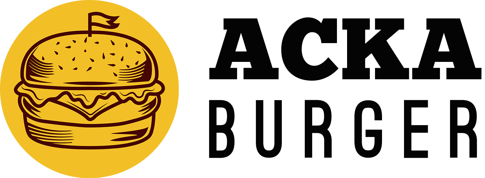
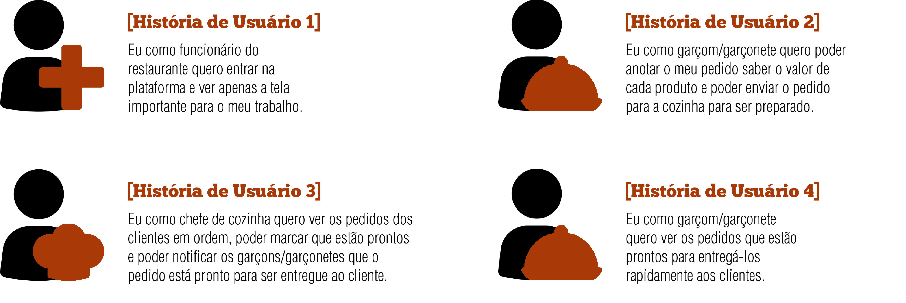
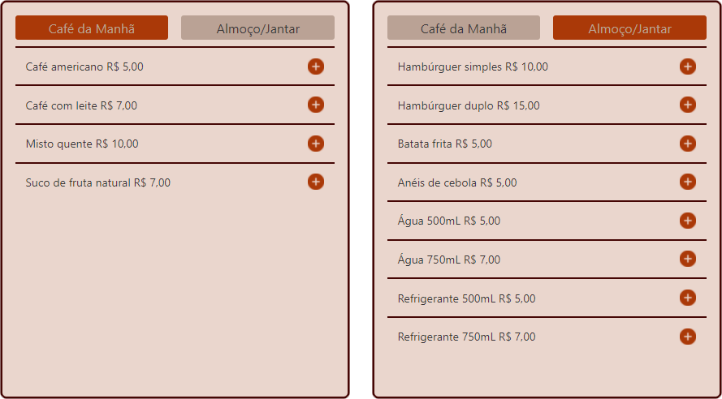

<h1 align="center">
  
</h1>

# Acka Burger

Aplicação web para o restaurante Acka Burger. A interface auxilia os funcionários do salão e da cozinha a fazerem e prepararem os pedidos de forma ordenada e eficiente.

> Status do Projeto: Concluído :heavy_check_mark:

## Índice

- [1. Apresentação da Demanda](#1-demanda)

---

## 1. Apresentação da Demanda

O cliente é uma hamburgueria 24 horas chamada Acka Burger e pediu um sistema que ajudasse a receber os pedidos dos clientes de forma mais rápida e que funcionasse bem em tablets. 

Para melhor realização do projeto, o _Product Owner_ nos apresentou quatro histórias de usuário:

  

 

Além disso, determinou-se quais seriam os critérios de aceitação e as definições de pronto de cada história:

 

#### Critérios de aceitação

- Criar login e senha.
- Registar tipo de usuário (cozinha / salão), login e senha.
- Entrar na tela correta para cada usuário.

#### Definição de pronto

- Você fez _testes_ de usabilidade e incorporou o feedback do usuário.
- Você deu deploy de seu aplicativo.

 

#### Critérios de aceitação

- Anotar o nome e mesa.
- Adicionar produtos aos pedidos.
- Excluir produtos.
- Ver resumo e o total da compra.
- Enviar o pedido para a cozinha (guardar em algum banco de dados).
- Funcionar bem e se adequar a um _tablet_.

#### Definição de pronto

- Você fez _testes_ de usabilidade e incorporou o _feedback_ do usuário.
- Você deu deploy de seu aplicativo.

 

#### Critérios de aceitação

- Ver os pedidos à medida em que são feitos.
- Marcar os pedidos que foram preparados e estão prontos para serem servidos.
- Ver o tempo que levou para preparar o pedido desde que chegou, até ser marcado como concluído.

#### Definição de pronto

- Você fez _testes_ de usabilidade e incorporou o _feedback_ do usuário.
- Você deu deploy de seu aplicativo.

 

#### Critérios de aceitação

- Ver a lista de pedidos prontos para servir.
- Marque os pedidos que foram entregues.

#### Definição de pronto

- Você fez _testes_ de usabilidade e incorporou o _feedback_ do usuário.
- Você deu deploy de seu aplicativo.
- Os dados devem ser mantidos intactos, mesmo depois que um pedido foi terminado. Tudo isso para poder ter estatísticas no futuro.

 

Por último, nos apresentou os menus que deveriam ser oferecido pelo sistema:

 

 
 

**Importante:** Os clientes também deveriam poder escolher entre hambúrgueres de carne bovina, frango ou vegetariano e, por um adicional de R$ 1,00, adicionar queijo ou ovo.

 

---
